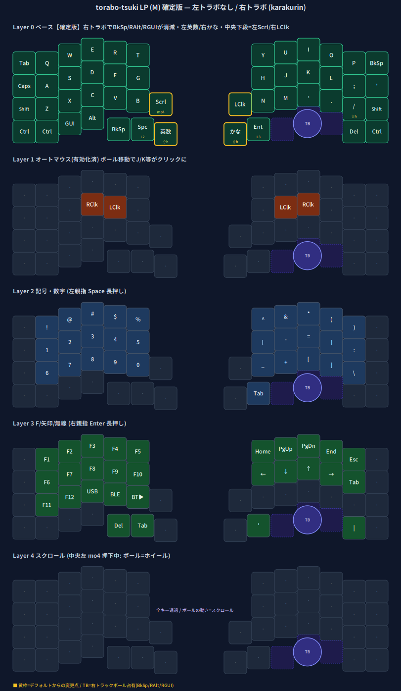

# torabo-tsuki LP (M) — karakurin keymap

[torabo-tsuki LP](https://github.com/sekigon-gonnoc/torabo-tsuki-lp)（[sekigon-gonnoc/zmk-keyboard-torabo-tsuki-lp](https://github.com/sekigon-gonnoc/zmk-keyboard-torabo-tsuki-lp) の fork）用の ZMK ファームウェア。
**M サイズ・右トラックボール**構成向けに keymap をカスタムしたものです。by **karakurin**（[@karakurin42](https://x.com/karakurin42)）。

## キーマップ

> 黄枠＝デフォルトからの変更点 / TB＝右トラックボール（BkSp/RAlt/RGUI を占有）/ `·` は透過(&trans)

## 確定版の変更点（M・右トラボ前提）

- **右トラックボール**で右親指の **BkSp / RAlt / RGUI が物理消滅** → 該当キーは `&none`（誤爆防止）。
- **中央キー（下段＝B/Nの段）を転用**：左＝**スクロール層モメンタリ**（押している間ボール＝ホイール）、右＝**確実な左クリック**（`&mkp LCLK`）。
- **オートマウス層（Layer 1）**：ボールを動かすと自動で有効化、ホームキー周辺（F/J 等）が左右クリックに。`zip_temp_layer` で 2 秒無操作で解除。`require-prior-idle-ms = 150`（打鍵直後でも出やすく）。
- **スクロール層（Layer 4）**：中央左キー押下中にボールをホイール化（`zip_xy_to_scroll_mapper`）。
- **IME を標準配置に**：左親指＝英数（`LANGUAGE_2`）/ 右親指＝かな（`LANGUAGE_1`）。IME キーは mod-tap（タップ=IME / 長押し=Shift）。
- 右端の RCtrl×2 → 内＝**Del** / 外＝**Ctrl**。
- **トラックボールの向き補正**：`&pointing_listener` の input-processors 先頭に `zip_xy_transform (X_INVERT | Y_INVERT)` を付与（これが無いと上下左右が反転する）。

レイヤー構成：`0`=ベース / `1`=オートマウス（クリック）/ `2`=記号・数字（左親指 Space 長押し）/ `3`=F・矢印・無線（右親指 Enter 長押し）/ `4`=スクロール。

## ファームの書き込み

1. [Releases](../../releases) から最新の `.uf2` をダウンロード（または Actions のビルド成果物 `firmware`）。
2. **central がついている `*_central.uf2` をトラックボール側（＝右）に、`*_peripheral.uf2` を反対側（左）に**書き込む。
   - この構成（右トラボ）では **右＝central**：右に `torabo_tsuki_lp_right_central.uf2` / 左に `torabo_tsuki_lp_left_peripheral.uf2`。
3. 各半身をブートローダ（リセット2回）→ 現れた USB ドライブに `.uf2` をドラッグ&ドロップ。
4. ペアリングがおかしいときは両半身に `settings_reset-bmp_boost-zmk.uf2` を入れてから上記を入れ直す。

## 編集

- keymap は [`config/keymap.keymap`](config/keymap.keymap)。GitHub Actions（push / 手動 Run）でビルドされます。
- 単純なキー差し替えは keymap-editor / ZMK Studio でも可能（ただし上記の input-processor 系の挙動は keymap ファイル側で定義）。

## ライセンス / クレジット

- 本リポジトリは [sekigon-gonnoc/zmk-keyboard-torabo-tsuki-lp](https://github.com/sekigon-gonnoc/zmk-keyboard-torabo-tsuki-lp) の fork（**GPL-3.0**）。ハード・基盤設計および元ファームは sekigon-gonnoc 氏。
- カスタム keymap・ドキュメント：karakurin。
